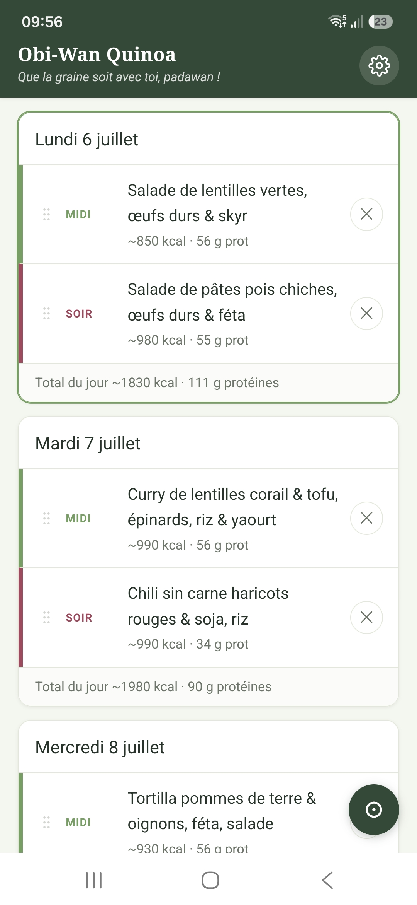
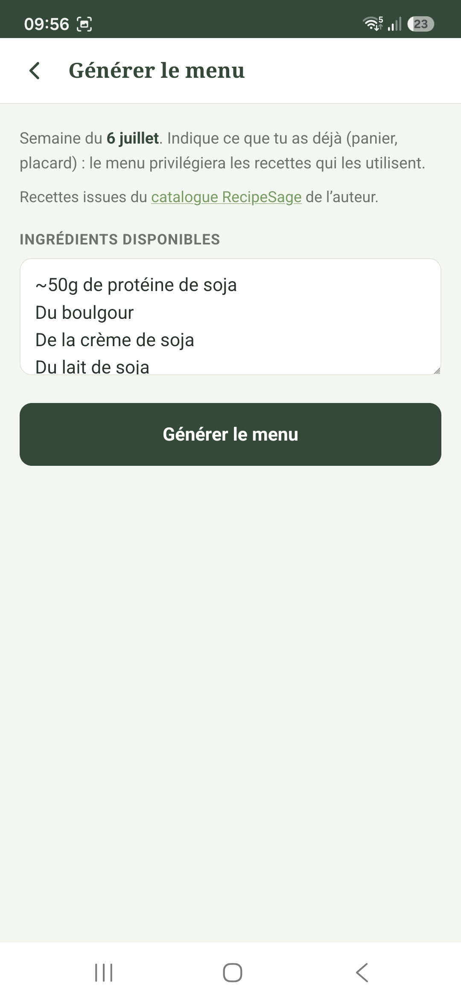
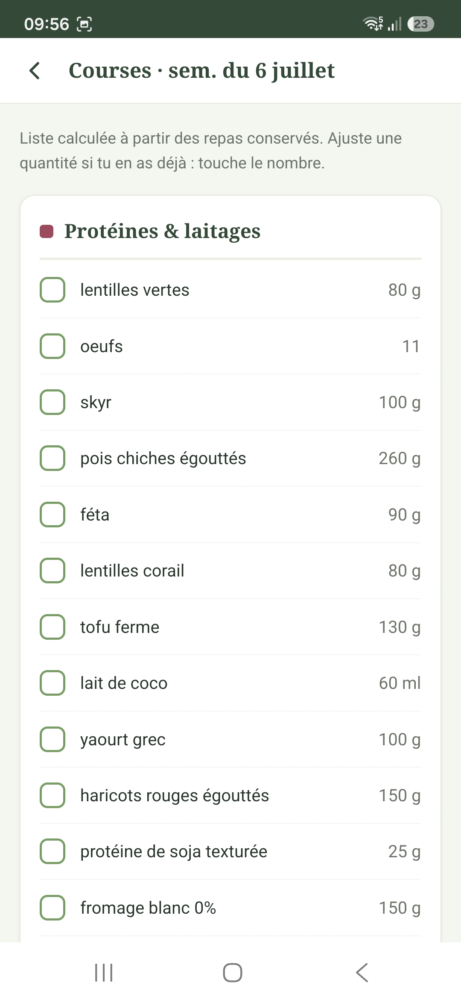
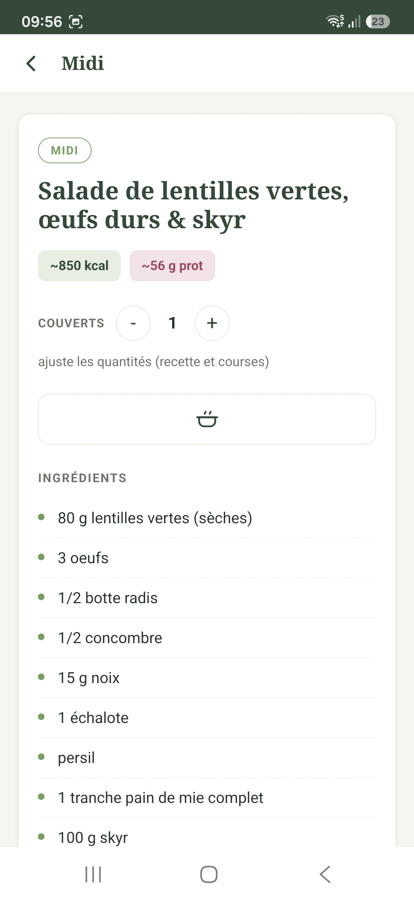
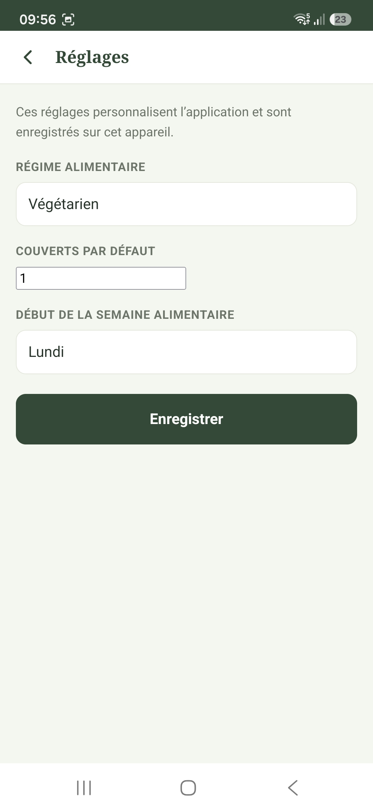

# Obi-Wan Quinoa

> Que la graine soit avec toi, padawan.

Application web (PWA) pour consulter un **catalogue de recettes végétariennes**, composer ses **menus de la semaine** et la **liste de courses** correspondante, **100 % hors-ligne** et hébergée sur GitHub Pages. Les menus sont **générés par l'application** (sans IA) à partir du catalogue, en privilégiant les ingrédients que l'on a déjà (panier AMAP, placard). Aucun backend, aucune authentification, aucune dépendance, aucun build.

Le **catalogue vit dans le dépôt** (`recipes/`, un fichier JSON par recette) : les données sont locales, versionnées et servies avec le site. Pour utiliser votre propre catalogue, **forkez** le projet et remplacez les fichiers de `recipes/`.

## Aperçu

<table>
<tr>
<td align="center" width="33%"><br><sub>Menu de la semaine</sub></td>
<td align="center" width="33%"><br><sub>Génération anti-gaspi</sub></td>
<td align="center" width="33%"><br><sub>Liste de courses</sub></td>
</tr>
<tr>
<td align="center"><br><sub>Détail d'une recette</sub></td>
<td align="center"><br><sub>Étapes de préparation</sub></td>
<td align="center"><br><sub>Réglages</sub></td>
</tr>
</table>

## Comment ça marche

- **Catalogue** (écran principal) : toutes les recettes (repas, bases, accompagnements, desserts), en **défilement infini**, avec **recherche** (titre + ingrédients) et **filtres** : type, régime, et **exclusion d'allergènes**. Toucher une recette ouvre sa **fiche de consultation** (ingrédients, étapes, nutrition, allergènes).
- **Navigation** : l'en-tête donne accès au **Menu** de la semaine (écran secondaire) et au **Catalogue** ; sur mobile, ces accès (plus Réglages et le mode IA) sont regroupés dans un **menu hamburger**.
- **Profil** (Réglages) : régime alimentaire, nombre de **couverts** par défaut, **début de la semaine** alimentaire (défaut jeudi, rythme AMAP).
- **Générer une semaine** : sur le marqueur de semaine, **« Générer »**, saisir les **ingrédients disponibles** (`1 courgette; 3 tomates; 200 g de lentilles`). L'app propose 7 jours × midi/soir en privilégiant les recettes qui consomment ces ingrédients (anti-gaspi), desserts exclus. **« Valider la semaine »** enregistre le menu. **Fonctionne hors-ligne.**
- **Au fil de l'eau** : plutôt que générer toute la semaine, on peut remplir les repas **un par un** — sur un créneau vide, **« Définir ce repas »** propose une recette à partir de la zone de saisie (avec re-tirage), sans toucher au reste de la semaine.

### Retoucher / utiliser

- **Couverts par repas** : sur une recette du menu, ajuster les couverts ; les quantités de courses se mettent à l'échelle.
- **Liste de courses** : calculée à partir des repas conservés. Toucher un nombre pour saisir la quantité **à acheter** (le besoin reste affiché « sur N »). Les ingrédients saisis à la génération sont **pré-déduits**. **Quand un repas est exclu** (retiré du menu), ses ingrédients **exclusifs** apparaissent **grisés/barrés** (non comptés) et les ingrédients **partagés** voient leur quantité **recalculée** sur les repas conservés.
- **Glisser-déposer** un repas (poignée) pour échanger midi/soir ou changer de jour ; **« je mange à l'extérieur »** retire un repas. Retouches locales.
- **Mode cuisine** : garder l'écran allumé pendant la préparation.

### Mise à jour du catalogue

Quand une nouvelle recette est publiée (voir ci-dessous) et que l'appareil est **en ligne**, l'app détecte une nouvelle version du catalogue et propose une **bannière « mettre à jour »** ; elle télécharge alors uniquement les recettes nouvelles/modifiées (delta) pour les rendre disponibles hors-ligne. Aucun rechargement complet nécessaire.

## Enrichir le catalogue (auteur)

Les recettes vivent dans le dépôt sous `recipes/<slug>.json`. Pour en ajouter une, l'auteur utilise la skill **Claude Code `/recipe`** : elle rédige une recette équilibrée et **sourcée** (ingrédients au format `quantité unité nom`, une ligne par ingrédient ; étapes claires ; **labels** de type et de régime ; **allergènes** ; nutrition par portion), la présente pour validation, puis **écrit le fichier, régénère l'index et committe directement sur `main`** (pas de PR — relecture en session ; la CI valide au push).

**Depuis le mobile** : l'app expose un **mode IA** masqué — 7 touchers sur le titre de l'en-tête (comme le mode développeur Android) révèlent l'entrée ✨ (dans le hamburger sur mobile), mémorisée sur l'appareil. Elle ouvre un écran où l'on décrit ce qu'on veut cuisiner ; l'app construit le prompt et l'ouvre dans **Claude Code mobile** avec le dépôt lié, de sorte que la skill `/recipe` s'applique. La session cloud (git + proxy GitHub) rédige la recette et **committe sur `main`** — **prérequis : la GitHub App Claude installée sur le dépôt**. Canal : `claude://code/new?repo=<owner/repo>&q=<prompt>`, avec repli documenté `https://claude.ai/code?repositories=<owner/repo>&prompt=<prompt>`.

**Qualité des recettes** (essentielle pour une liste de courses cohérente et des étapes lisibles) : ingrédients à **nom canonique unique** (mêmes libellés partout, singulier générique), **une ligne par ingrédient** (pas d'énumération ni de sous-recette), unités métriques de la liste blanche ; **étapes simples** (une action par étape). `scripts/lint_recipes.mjs` audite ces points ; `scripts/validate_recipes.mjs` les verrouille.

**Convention de labels** : un label de **type** — `repas` (seules ces recettes entrent dans la génération), `base`, `accompagnement`, `dessert` — et un ou plusieurs labels de **régime** (`végétarien`, `vegan` — additif, `sans-gluten`, `sans-lactose`). Les allergènes sont dans le champ dédié `allergenes` (set fermé aligné annexe II INCO/UE), pas en label.

> Les recettes de **dessert** existantes sont optimisées par l'auteur : leurs quantités et instructions ne sont pas modifiées (seuls les libellés d'ingrédients sont harmonisés).

### Équilibre alimentaire visé (référence d'écriture des recettes)

Cibles de l'auteur, appliquées par la skill `/recipe` (détail et sources : [`.claude/skills/recipe/references/nutrition.md`](.claude/skills/recipe/references/nutrition.md)) :

- **~1900 kcal/j** (déficit léger ~500 kcal ; Mifflin-St Jeor) et **~115 g de protéines/j**.
- Régime **lacto-ovo** : veiller oméga-3, vitamine D, **B12**, calcium ; **fer + vitamine C** le même jour.
- **Produits de saison**, sel limité (**< 5 g/j** ; OMS / Santé publique France).

## Fonctionnement technique

- `index.html` — la PWA (HTML/CSS/JS, sans dépendance, sans build) : catalogue (écran principal), navigation, planning, génération (semaine ou repas à l'unité), liste de courses, consultation, mode IA.
- `logic.js` — logique pure sans DOM (dates, matérialisation des menus, calcul des courses, **parser d'ingrédients FR**, **moteur de génération**, `slugify`, `catalogueFilter`, `diffCatalogue`, `ALLERGENES`, **prompt de rédaction**), testée en Node.
- `catalogue.js` — chargeur du **catalogue local** : `catGetRecipes()` (lit `recipes/index.json`), `catGetRecipe(id)` (lit `recipes/<id>.json`), `catMapRecipe()` (dérive la liste de courses). Aucune dépendance réseau tierce.
- `recipes/` — le catalogue : un fichier `<slug>.json` par recette (champs rédigés ; la liste de courses est dérivée), les images sous `recipes/images/`, et `index.json` (manifeste allégé + `version`/`hash` pour la détection de mise à jour).
- `sw.js` — service worker : *network-first* sur HTML/JSON, *cache-first* sur les statiques, **précache dynamique** du catalogue (recettes + images) pour le hors-ligne dès la première visite.
- `manifest.webmanifest` — métadonnées PWA (installable, hors-ligne).
- `.claude/skills/recipe/` — la skill d'écriture de recettes (`SKILL.md`) et son référentiel nutrition **sourcé** (`references/nutrition.md`).

Site 100 % statique, sans clé d'API ni serveur.

### Tester en local

```sh
python3 -m http.server 8000   # puis ouvrir http://localhost:8000
```

(Le service worker et le chargement des JSON nécessitent `http(s)://`, pas `file://`.)

### Scripts (dev / CI, jamais expédiés au navigateur)

- `scripts/export_catalogue.mjs` — export unique (one-shot) du catalogue depuis l'ancienne source vers `recipes/` (historique de migration).
- `scripts/build_index.mjs` [`--check`] — (re)génère `recipes/index.json` (déterministe) ; `--check` échoue si l'index est périmé ou en collision d'`id`.
- `scripts/validate_recipes.mjs` — valide le catalogue (schéma, nutrition, exactement un label de type, allergènes du set fermé, ingrédients atomiques, `id` = nom de fichier + unicité, images présentes).
- `scripts/lint_recipes.mjs` [`--vocab`|`--json`] — audit hygiène de la liste de courses (doublons, unités parasites, lignes composées) + alerte allergène probable non déclaré.
- `scripts/compute_nutrition.mjs` — calcule la nutrition manquante par somme des ingrédients (table `scripts/nutrition_table.json`, Ciqual/USDA) / portions.
- `scripts/validate.py` — intégrité statique (manifest, assets, liens locaux, présence du catalogue).

### Validation & CI

- `python3 scripts/validate.py` — intégrité statique + présence/cohérence du catalogue.
- `node --test` — tests unitaires (`logic.js`, `catalogue.js`, `scripts/catalogue_lib.mjs`).
- `node scripts/validate_recipes.mjs` + `node scripts/build_index.mjs --check` — validation du catalogue + fraîcheur de l'index.
- CI (`.github/workflows/ci.yml`) **path-aware** : un job `changes` (git diff) détermine les groupes modifiés ; les jobs (validation statique, syntaxe, tests, recettes, scan de secrets) ne tournent que si leur groupe change ; un unique statut `ci-ok` est requis par la protection de branche. Sans dépendance, aucun secret.
- Déploiement Pages via `.github/workflows/pages.yml` (source *GitHub Actions*), avec anti-collision et retry.

## Sources

- **Singulier/pluriel des ingrédients** : [Lexique 3.83](http://www.lexique.org/) (CC-BY-SA 4.0) ; alternative [Morphalou 3.1](https://www.ortolang.fr/market/lexicons/morphalou).
- **Noms canoniques d'ingrédients** : [taxonomie *ingredients* d'Open Food Facts](https://github.com/openfoodfacts/openfoodfacts-server/tree/main/taxonomies) (ODbL).
- **Grammages par portion** : [GEM-RCN — *Recommandation Nutrition* v2.0](https://www.economie.gouv.fr/daj/recommandation-nutrition).
- **Valeurs nutritionnelles** (calcul de la nutrition) : [Ciqual — ANSES](https://ciqual.anses.fr/) / [USDA FoodData Central](https://fdc.nal.usda.gov/).
- **Repères nutritionnels** (détail dans [`nutrition.md`](.claude/skills/recipe/references/nutrition.md)) : [ANSES 2025](https://www.anses.fr/fr/content/regimes-vegetariens-effets-sur-la-sante-et-reperes-alimentaires), [Santé publique France / Manger Bouger](https://www.mangerbouger.fr/), [OMS — sodium](https://www.who.int/news-room/fact-sheets/detail/sodium-reduction), [EFSA](https://www.efsa.europa.eu/), [NIH ODS — fer](https://ods.od.nih.gov/factsheets/Iron-HealthProfessional/), [NHS](https://www.nhs.uk/live-well/eat-well/), Mifflin-St Jeor (1990), [ADEME](https://www.ademe.fr/).

## Avertissement

Les repères nutritionnels sont des informations générales issues de sources publiques, **pas un avis médical individualisé**.
